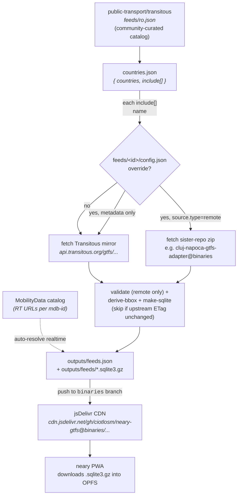

# neary-gtfs

Multi-feed GTFS publisher for the [neary](https://github.com/ciotlosm/neary) PWA.

> [!NOTE]
> **Live registry** (single source of truth for what's currently published):
> [`https://cdn.jsdelivr.net/gh/ciotlosm/neary-gtfs@binaries/feeds.json`](https://cdn.jsdelivr.net/gh/ciotlosm/neary-gtfs@binaries/feeds.json)

Acts as a **thin curation + SQLite-conversion layer**:
fetches well-validated GTFS zips (from [Transitous](https://transitous.org/),
or from a sister repo with a richer build for that operator), converts to
SQLite for fast in-browser querying, and publishes one app-facing `feeds.json`
registry.

## How it layers

Two upstreams (Transitous mirrors, sister-repo remotes), one app-facing
registry — the app doesn't have to know any of this. It fetches
`feeds.json`, picks the user's feed by GPS bbox, downloads one
`.sqlite3.gz` blob. Done.

## What it produces

Published nightly to the `binaries` branch by
[`.github/workflows/daily.yml`](.github/workflows/daily.yml):

| File | Source | Consumer |
|------|--------|----------|
| `feeds.json` | pipeline | neary app (single registry) |
| `<id>.sqlite3.gz` | [`make-sqlite.js`](src/pipeline/make-sqlite.js) | neary app (OPFS) |

The raw `.gtfs.zip` is not republished — consumers that want it fetch
it directly from the URL recorded in `source.upstream_url`.

> [!NOTE]
> `feeds.json` is Ajv-validated against
> [`schemas/feeds.schema.json`](schemas/feeds.schema.json) (draft-2020).
> Remote sister-repo zips also get a light Node-side structural check
> ([`src/pipeline/validate.js`](src/pipeline/validate.js)) plus a
> per-feed smoke contract check
> ([`src/pipeline/smoke-remote.js`](src/pipeline/smoke-remote.js)) —
> Transitous mirrors are trusted to upstream validation.

## Pipeline

Daily orchestrator + helpers live in [`src/pipeline/`](src/pipeline/README.md) —
see that README for the step-by-step build flow and the skip-on-unchanged
mechanism. Run locally with `npm run pipeline`.

### Per-feed overrides

Each subdirectory of `feeds/` is one Transitous source name we override
with extra config (and optionally a different zip URL):

- [`feeds/cluj-napoca/config.json`](feeds/cluj-napoca/config.json) —
  `source.type=remote` pointing at
  [`ciotlosm/cluj-napoca-gtfs-adapter`](https://github.com/ciotlosm/cluj-napoca-gtfs-adapter)
  (a multi-source reconciler with fresher CTP schedules than Transitous's
  mdb-2121 mirror)

> [!TIP]
> To add another override, see [DEVELOPMENT.md § Adding a feed](DEVELOPMENT.md#adding-a-feed).
> No JS edits needed — drop a `feeds/<id>/config.json` with
> `enhances: "<TransitousName>"` and the pipeline picks it up.

## Structure

The flow is in the [Mermaid diagram above](#how-it-layers);
`ls -R src/pipeline feeds/` shows the file tree.

Two conceptual entry points worth knowing:

- [`countries.json`](countries.json) — single source of truth for what we publish
- [`feeds/<id>/config.json`](feeds/) — drop one of these to override a Transitous mirror with a sister-repo zip (`source.type=remote`) and/or to overlay metadata, realtime URLs, etc.

## Local development

See [DEVELOPMENT.md](DEVELOPMENT.md).

## License

Schedule data © its respective transit operators (per-feed
`license.attribution_text` in `feeds.json`). Generated for public transit
information purposes.
