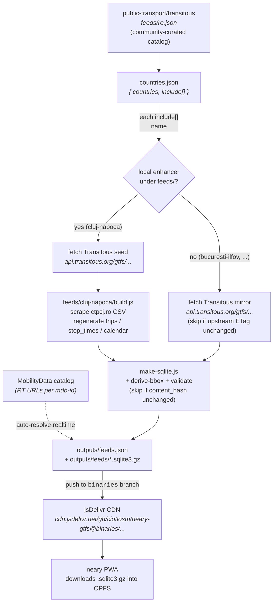

# neary-gtfs

Multi-feed GTFS publisher for the [neary](https://github.com/ciotlosm/neary) PWA.

> [!NOTE]
> **Live registry** (single source of truth for what's currently published):
> [`https://cdn.jsdelivr.net/gh/ciotlosm/neary-gtfs@binaries/feeds.json`](https://cdn.jsdelivr.net/gh/ciotlosm/neary-gtfs@binaries/feeds.json)

Acts as a **thin curation layer on top of Transitous + MobilityData**:
fetches their well-validated zips, optionally enhances them (Cluj gets
fresh CTP CSV-scraped schedules), converts to SQLite for fast in-browser
querying, and publishes one app-facing `feeds.json` registry.

## How it layers

Three publishers (Transitous, MobilityData, us), one app-facing
registry — the app doesn't have to know any of this. It fetches
`feeds.json`, picks the user's feed by GPS bbox, downloads one
`.sqlite3.gz` blob. Done.

## What it produces

Published nightly to the `binaries` branch by
[`.github/workflows/daily.yml`](.github/workflows/daily.yml):

| File | Source | Consumer |
|------|--------|----------|
| `feeds.json` | pipeline | neary app (single registry) |
| `feeds/<id>.sqlite3.gz` | [`make-sqlite.js`](src/pipeline/make-sqlite.js) | neary app (OPFS) — **always present** |
| `feeds/<id>.gtfs.zip` | local enhancement ([`feeds/<id>/build.js`](feeds/)) | external GTFS tools — **only for `source.type === 'build'` feeds**; mirrors are accessible via Transitous's own URL |

> [!NOTE]
> `feeds.json` is Ajv-validated against
> [`schemas/feeds.schema.json`](schemas/feeds.schema.json) (draft-2020).
> Locally-built zips also get a light Node-side structural check
> ([`src/pipeline/validate.js`](src/pipeline/validate.js)) — Transitous
> mirrors are trusted to upstream validation.

## Pipeline

Daily orchestrator + helpers live in [`src/pipeline/`](src/pipeline/README.md) —
see that README for the step-by-step build flow and the skip-on-unchanged
mechanism. Run locally with `npm run pipeline`.

### Locally-enhanced feeds

Each subdirectory of `feeds/` documents its own enhancement:

- [`feeds/cluj-napoca/`](feeds/cluj-napoca/README.md) — CTP Cluj
  schedule enhancement (daily CSV scrape on top of the Transitous seed)

> [!TIP]
> To add another locally-enhanced feed, see
> [DEVELOPMENT.md § Adding a feed](DEVELOPMENT.md#adding-a-feed).
> No JS edits needed — drop a `feeds/<id>/config.json` with
> `enhances: "<TransitousName>"` + a `build.js` and the pipeline
> picks it up.

## Structure

The flow is in the [Mermaid diagram above](#how-it-layers); `ls -R src/pipeline feeds/` shows the file tree.

Two conceptual entry points worth knowing:

- [`countries.json`](countries.json) — single source of truth for what we publish
- [`feeds/<id>/`](feeds/) — drop a `config.json` with `enhances: "<TransitousName>"` + a `build.js` here to add a local enhancement layer over a Transitous mirror (no JS edits in `src/pipeline/`)

## Local development

See [DEVELOPMENT.md](DEVELOPMENT.md).

## License

Schedule data © CTP Cluj-Napoca. Generated for public transit information purposes.
