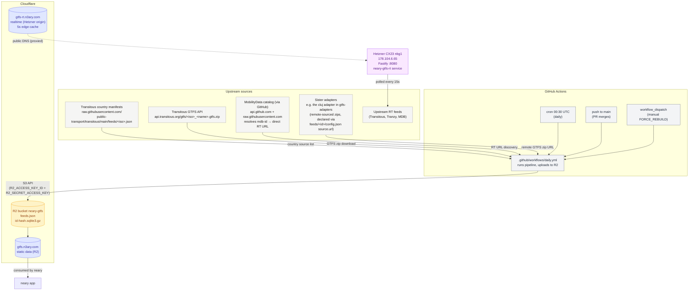

# Infrastructure

Every cloud / external piece this repo's pipeline touches, in one diagram + one table. Cross-references the relevant docs for detail; this doc is the **index** for "what runs where and what breaks if it dies". Only current infrastructure — future work lives in issues.

Cross-refs:
- Pipeline development + CI workflow — [DEVELOPMENT.md](../../DEVELOPMENT.md)
- Pipeline anatomy — [README.md](../../apps/gtfs-static/src/README.md)
- Sister repo that consumes the outputs — [n3ary/app](https://github.com/n3ary/app) (formerly `ciotlosm/neary`, renamed in #53)

## Diagram

## Component table

| Component | Role | Owner | Cost driver | Failure impact |
|---|---|---|---|---|
| **GitHub Actions — cron 00:30 UTC** | Daily rebuild of all feeds after Transitous's ~00:00 UTC daily import | GitHub | Free tier (2 000 min/month) | Stale data after the first missed day |
| **GitHub Actions — push to main** | Rebuild on PR merge to `main` (docs-only PRs skipped via `paths-ignore`) | GitHub | Free tier | (intended no-op via content-addressed cache) |
| **GitHub Actions — workflow_dispatch** | Manual `FORCE_REBUILD=true` rebuild — used after pipeline code changes that affect output | GitHub | Free tier | — |
| **GitHub Actions — PR validation** | `npm run pipeline` + `npm test` + `npm run lint` on every PR | GitHub | Free tier | PR can't merge |
| **Cloudflare R2** — `neary-gtfs` bucket | Stores `feeds.json` + `<id>-<hash12>.sqlite3.gz` | Cloudflare | $0.015/GB/month + $0.36/M Class A operations | Sister repo can't fetch data |
| **Custom domain** — `gtfs.n3ary.com` → R2 | Public URL for the R2 bucket (static data) | Cloudflare | Free with R2 | Data URL down |
| **Custom domain** — `gtfs-rt.n3ary.com` → Hetzner origin (proxied) | Public URL for the realtime API. CF edge enforces a 5 s edge cache via a Cache Rule (matches the adapter's own `Cache-Control: public, max-age=5`). The Hetzner origin serves the public path directly (`/rt/<feed>/<snake_case>`); the URL is intentionally separate from `gtfs.n3ary.com` so static-data and realtime API live on different hostnames (different cache-key spaces, different failure modes, different upstream owner). | Cloudflare | Free | Realtime URL down / returns 521 if origin is unreachable |
| **Transitous country manifests** (`raw.githubusercontent.com/public-transport/transitous/main/feeds/<iso>.json`) | Per-country source list with `name` + `spec` + `mdb-id` etc. | Transitous (via GitHub raw) | Free | Most feeds missing |
| **Transitous GTFS API** (`api.transitous.org/gtfs/<iso>_<name>.gtfs.zip`) | The actual `.gtfs.zip` download for plain-mirror feeds | Transitous | Free | Most feeds missing |
| **MobilityData catalog** (via `api.github.com` git tree + `raw.githubusercontent.com/...mobility-database-catalogs/main/`) | Resolves Transitous `mdb-id`s into direct RT URLs (`vehicle_positions`, `trip_updates`, `service_alerts`); the resolved URLs get stamped into `feeds.json` | MobilityData (via GitHub) | Free; honors `GITHUB_TOKEN` for higher rate limit | RT URLs missing or wrong in the published `feeds.json` |
| **Sister adapter zips** (e.g. [gtfs-adapters/cluj-napoca](https://github.com/n3ary/gtfs-adapters/tree/main/adapters/cluj-napoca)) | Reconciled GTFS zip for specific feeds; consumed via `feeds/<id>/config.json` `source.type=remote` pointing at `source.url` | Each adapter's repo | (their infra) | Feeds sourced from that adapter stale |
| **n3ary/app** (sister repo, formerly `ciotlosm/neary`) | Consumer of the published artifacts | [n3ary/app repo](https://github.com/n3ary/app) | (its own infra) | Data freshness signal missing |

## Secrets + variables (GitHub repo settings)

Driving the R2 upload (defined in [DEVELOPMENT.md](../../DEVELOPMENT.md) lines 124-128):

| Name | Type | Purpose |
|---|---|---|
| `R2_ACCESS_KEY_ID` | secret | R2 S3-compatible token, scoped Object Read+Write on `neary-gtfs` bucket |
| `R2_SECRET_ACCESS_KEY` | secret | (paired with access key) |
| `R2_S3_ENDPOINT` | variable | S3-compatible endpoint URL |
| `R2_BUCKET` | variable | Bucket name (currently `neary-gtfs`) |
| `R2_PUBLIC_BASE_URL` | variable | Public base URL for `Cache-Control: public, max-age=31536000, immutable` |
| `GITHUB_TOKEN` | secret | Set in CI for higher rate limit on `api.github.com` (MDB catalog lookup). Optional — 60 req/hour is enough for 1-call-per-run. |

Uploads set `Cache-Control: public, max-age=300` on `feeds.json` and each `<id>.sqlite3.gz` — propagation stays bounded to ≤ 5 min per publish, matches the previous GitHub-raw behavior the sister repo's consumer relied on.

<!-- The R2 bucket is named `neary-gtfs` for historical reasons. We renamed the GitHub repo to `n3ary/gtfs` but kept the bucket name (and CDN URL `gtfs.n3ary.com`) to avoid breaking external links. -->
